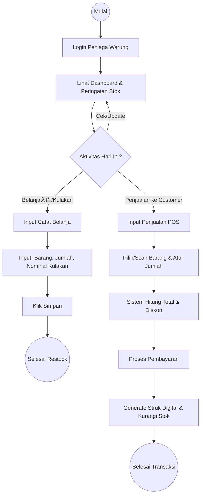
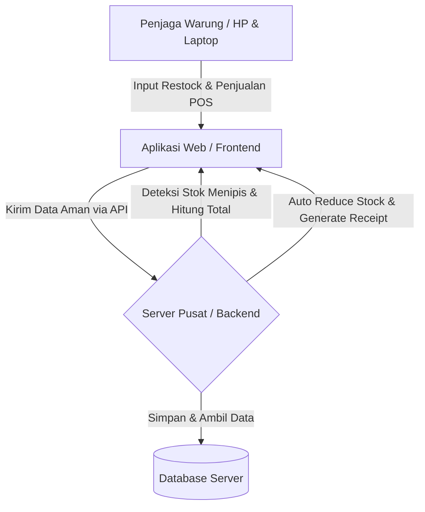
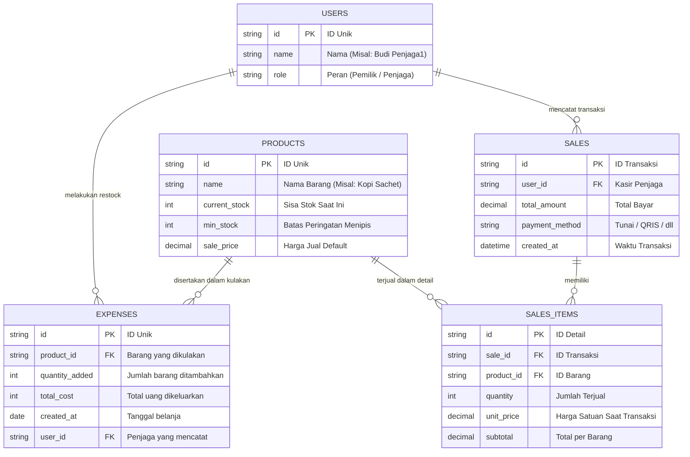

# PRD — Project Requirements Document

## 1. Overview
Aplikasi ini adalah sistem Point of Sale (POS) dan manajemen inventaris sederhana yang dirancang khusus untuk operasional warung. Masalah utama yang ingin diselesaikan adalah kebiasaan penjaga warung yang sering kurang teliti atau lupa mencatat pengeluaran belanja harian, serta ketidaksinkronan antara stok fisik dan data pencatatan.

Tujuan utama dari aplikasi ini adalah menyediakan alat ukur yang sangat mudah digunakan oleh penjaga warung untuk mencatat belanja, memproses penjualan ke pelanggan, dan mengecek stok secara realtime. Dengan sistem berbasis *cloud*, aplikasi ini menjamin data "anti hilang", sehingga pemilik warung dapat memantau arus kas, stok masuk/keluar, dan ketersediaan barang secara akurat tanpa takut catatan hilang, rusak, atau tidak terupdate.

## 2. Requirements
- **Kemudahan Penggunaan (Usability):** Antarmuka (UI) harus sangat sederhana dan intuitif karena target penggunanya adalah penjaga warung dengan pengalaman teknologi yang bervariasi.
- **Pencatatan Cepat (First Win):** Proses memasukkan data belanja/restock maupun penjualan ke customer harus bisa diselesaikan dalam beberapa klik/ketukan saja.
- **Pengurangan Stok Otomatis:** Setiap kali transaksi POS berhasil diproses, sistem harus otomatis mengurangi jumlah stok produk terkait untuk menjaga keakuratan inventaris tanpa input manual tambahan.
- **Otomatisasi Peringatan:** Sistem harus bisa mendeteksi dan memberi tahu secara otomatis jika ada barang yang stoknya sudah sedikit (menipis).
- **Keamanan Data:** Data harus langsung tersimpan secara *online* (real-time sinkronisasi) agar ketika perangkat yang digunakan rusak atau hilang, history pengeluaran, stok, dan riwayat penjualan tetap aman.
- **Aksesibilitas:** Berbasis web agar bisa diakses dari HP, tablet, maupun laptop yang ada di warung tanpa perlu instalasi aplikasi berat.
- **Kompabilitas Cetak Struk:** Sistem harus mampu generate layout struk digital yang rapi dan kompatibel dengan printer bawaan browser maupun printer thermal standar via web.

## 3. Core Features
- **Catat Belanja Harian (Restock):** Fitur utama bagi penjaga warung untuk mencatat nominal uang yang dikeluarkan untuk kulakan/belanja barang dagangan hari itu.
- **Transaksi Penjualan POS (Point of Sale):** Fitur untuk mencatat pembelian customer secara realtime. Penjaga bisa memilih barang, mengatur jumlah, sistem otomatis menghitung total, memproses pembayaran, serta mengurangi stok dengan akurat.
- **Pembuatan Struk Digital:** Setelah pembayaran diselesaikan, sistem akan otomatis membuat struk belanja lengkap (detail barang, harga satuan, total, metode pembayaran, tanggal, dan identitas warung) yang siap dicetak atau dipreview sebelum disimpan ke riwayat.
- **Monitor Stok Barang:** Halaman visual yang menampilkan daftar barang beserta jumlah sisa stoknya secara akurat dan terupdate secara realtime.
- **Notifikasi Stok Menipis:** Indikator visual (seperti warna merah atau badge peringatan) yang otomatis muncul ketika stok sebuah barang berada di bawah batas wajar, mengingatkan penjaga warung untuk segera belanja.
- **Sistem "Anti Hilang Data" (Auto-Save):** Fitur di belakang layar yang memastikan setiap data yang diketik langsung tersimpan ke *database server*, riwayat tidak akan bisa dimanipulasi atau hilang terhapus tanpa jerik.

## 4. User Flow
Berikut adalah perjalanan penjaga warung saat menggunakan aplikasi, visualisasikan melalui diagram alur di bawah ini:

**Penjelasan Langkah:**
1. **Login:** Penjaga warung membuka aplikasi dan masuk menggunakan akunnya (berfungsi agar sistem tahu siapa yang mencatat/restock/mencetak struk).
2. **Cek Dashboard & Peringatan:** Di halaman utama, penjaga warung langsung melihat daftar barang yang stoknya menipis dan perlu dibeli hari ini, serta ringkasan harian.
3. **Cabang Aktivitas:** Penjaga memilih apakah akan melakukan `Catat Belanja (Restock)` atau `Penjualan POS`.
4. **Alur Restock:** Penjaga menekan tombol "Catat Belanja", memasukkan jenis barang, jumlah yang ditambahkan ke stok, dan total uang yang dikeluarkan. Setelah klik simpan, sistem menambah stok, mencatat pengeluaran di buku kas, dan menyimpan datanya permanen di *cloud*.
5. **Alur Pos:** Penjaga menekan tombol "Penjualan POS", memilih barang yang dibeli customer, sistem menghitung total otomatis. Setelah pembayaran dikonfirmasi, sistem mengurangi stok produk secara realtime, menyimpan riwayat transaksi, dan menampilkan struk siap cetak.
6. **Sinkronisasi Realtime:** Semua perubahan stok dan transaksi langsung terupdate di server pusat, menjamin data pemilik warung selalu sinkron tanpa perlu refresh manual.

## 5. Architecture
Aplikasi ini akan menggunakan arsitektur web terpusat (Client-Server) di mana gawai di warung hanya bertugas menampilkan dan mengirim data, sedangkan proses penyimpanan, logika pengurangan stok, dan perhitungan total dilakukan di server. Hal ini menjamin keamanan data (Anti Hilang) dan konsistensi inventaris.

## 6. Database Schema
Untuk menjaga agar sistem tetap ringan namun efektif, kita hanya membutuhkan beberapa tabel penyimpanan data utama.

**Daftar Tabel & Kegunaan:**
- **Users:** Menyimpan data pengguna (pemilik dan penjaga warung) untuk sistem login yang aman.
- **Products:** Menyimpan daftar barang dagangan di warung, termasuk sisa stok saat ini, batas stok minimal, dan harga jual.
- **Expenses (Pengeluaran):** Mencatat setiap aktivitas restock yang dilakukan penjaga warung.
- **Sales:** Mencatat header transaksi penjualan (total, waktu, kasir, metode bayar).
- **Sales_Items:** Menyimpan detail per-barang dalam satu transaksi penjualan (jumlah terjual, harga satuan, subtotal).

## 7. Tech Stack
Berdasarkan kebutuhan untuk membuat web yang cepat, mudah diakses, gratis untuk dikembangkan awal, dan menjamin data aman, berikut adalah rekomendasi teknologinya:

- **Frontend & Backend (Framework):** **Next.js** (Satu teknologi untuk mengurus tampilan UI dan server logika sekaligus, membuat pengembangan lebih cepat dan mudah dikelola).
- **Styling UI:** **Tailwind CSS** (Untuk membuat desain yang rapi dan seragam dengan cepat).
- **Komponen UI:** **shadcn/ui** (Menyediakan tombol, form, dan tabel yang sudah jadi dan profesional, sangat bagus untuk membuat aplikasi sekelas POS).
- **Database Management (ORM):** **Drizzle ORM** (Penghubung bahasa manusia ke bahasa database yang sangat cepat dan anti-error).
- **Database:** **SQLite** (Database yang sangat ringan, murah, namun sangat handal untuk skala warung). Tersimpan di server untuk menghindari kehilangan data lokal.
- **Autentikasi:** **Better Auth** (Sistem login yang aman dan mudah diimplementasikan, memastikan hanya penjaga warung dari HP yang diizinkan yang bisa masuk).
- **Pencetakan & Receipt:** **Browser Print API + CSS @media print** (Mengatur layout struk thermal standar 58mm/80mm secara native tanpa perlu install plugin atau wrapper tambahan, kompatibel dengan semua printer modern yang terhubung ke perangkat).

## 8. Deployment
Strategi deployment dirancang untuk memastikan aplikasi berjalan stabil, aman, dan mudah diperbarui tanpa mengganggu operasional warung. Mengingat tech stack menggunakan Next.js dan SQLite, pendekatan cloud-native akan diutamakan untuk menjaga data tetap "anti hilang" dan tersinkronisasi secara real-time di lingkungan serverless.

- **Hosting Frontend & Backend:** **Vercel** akan digunakan sebagai platform utama. Vercel secara otomatis menangani deployment Next.js dengan fitur Edge Runtime dan Serverless Functions, sehingga biaya operasional tetap minimal saat traffic masih rendah, namun secara otomatis skalabel jika usaha warung berkembang atau membuka cabang.
- **Database Cloud-Native (SQLite di Serverless):** Untuk mengatasi batasan file SQLite lokal pada arsitektur serverless, **Turso** (berbasis LibSQL) dipilih sebagai solusi database. Turso menyediakan database SQLite yang sepenuhnya terdistribusi di cloud, mendukung replikasi edge, dan menjamin sinkronisasi data real-time tanpa risiko konflik penulisan atau kehilangan koneksi. Ini selaras sempurna dengan Drizzle ORM dan konsep "anti hilang data".
- **Alternatif VPS Sederhana:** Jika pemilik warung lebih menginginkan kontrol penuh atau preferensi biaya tetap bulanan, deployment dapat dilakukan di **VPS** (seperti DigitalOcean atau AWS Lightsail) menggunakan container Docker + PM2 + file SQLite standar. Pendekatan ini tetap sederhana namun memerlukan pemeliharaan server secara manual (update OS, SSL, dan monitoring).
- **CI/CD & Kemudahan Update:** Setiap perubahan kode (feature baru, perbaikan bug, atau penyesuaian UI) akan memicu proses deployment otomatis langsung dari repository Git (GitHub/GitLab) ke Vercel. Pipeline CI/CD ini menghilangkan risiko *human error* saat update manual, memastikan versi terbaru aplikasi langsung aktif dalam hitungan menit, dan menyimpan riwayat perubahan secara terstruktur.
- **Keamanan & Kontinuitas Data:** Vercel akan dikonfigurasi dengan Environment Variables yang terenkripsi untuk menyimpan kredensial database dan kunci API. Turso menyediakan fitur snapshot & backup otomatis harian. Selaras dengan prinsip inti aplikasi, arsitektur deployment ini menjamin bahwa data transaksi, stok, dan identitas pengguna tetap tersedia, terproteksi, dan dapat dipulihkan kapan pun diperlukan tanpa down-time yang signifikan.
